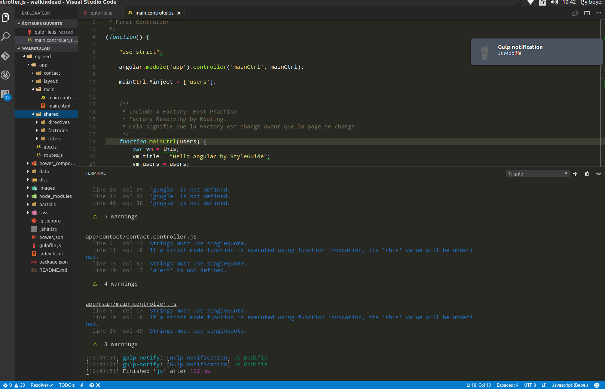

# Angular WalkinDead Pedagogique App

### Launch

Start JSON Server

```
 json-server --watch data/walkindead.json
```

### Stacks
* Angular 1
* Components Philosophy
* Angular StyleGuide
* Angular Include partial views
* Angular Route
* Angular Animate
* Angular Form Valid
* Use $q library
* Use Google Map in Directive
* Resolving Routing
* Use Lodash library
* Gulp & Bower Deps
* BrowserSync
* SourceMaps Files
* SASS
* Service, Factory, Directive & Filters




# Installation

To install this architecture:
clone that, then:

```
npm install && bower install
gulp 
```

